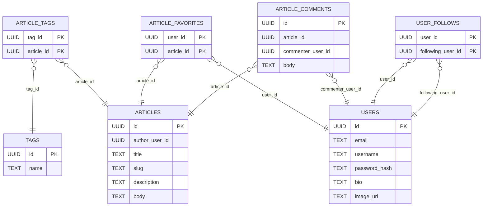

# 

> ## [Flask](https://flask.palletsprojects.com) + [PostgreSQL](https://www.postgresql.org) codebase containing real world examples (CRUD, auth, advanced patterns, etc) that adheres to the [RealWorld](https://github.com/gothinkster/realworld) spec and API

### [Demo](https://demo.realworld.io/)&nbsp;&nbsp;&nbsp;&nbsp;[RealWorld](https://github.com/gothinkster/realworld)

This codebase was created to demonstrate a fully fledged fullstack application built with [Flask](https://flask.palletsprojects.com) including CRUD operations, authentication, routing, pagination, and more.

We've gone to great lengths to adhere to the [Flask](https://flask.palletsprojects.com) community styleguides & best practices.

For more information on how to this works with other frontends/backends, head over to the [RealWorld](https://github.com/gothinkster/realworld) repo.

## How it works

### Directory Structure

```
/alembic
/realworld
│   app.py
│   /api
│   │   /core
│   │   │   auth.py
│   │   │   db.py
│   │   │   models.py
│   │   /routes/v1
│   │   │   /articles
│   │   │   │   endpoints.py
│   │   │   │   models.py
│   │   │   │   handlers.py
│   │   │   /profiles
│   │   │   │   ...
│   │   │   /users
│   │   │   │   ...
/scripts
/tests (only covering reasonable scenarios)
```

### Data Model



## Getting started

### Clone the repository

```bash
git clone git@github.com:mhegelheimer/realworld-flask.git
```

### Configure Environment Variables

Update the `.env` file with your desired configuration or leave as is for local development.

```shell
# don't change
export FLASK_APP=realworld.app

# configure
export FLASK_ENV=development
export FLASK_RUN_PORT=8080
export POSTGRES_HOST=postgres
export POSTGRES_DB=realworlddb
export POSTGRES_USER=testuser
export POSTGRES_PASSWORD=changeme
```

### Run with Docker

Ensure you have Docker installed ([install here](http://docs.docker.com/get-docker/)) and running on your machine.

```bash
docker info
```

See the `run` script for available commands.

```bash
# Start the server
./run server
```

Other commands include:

```bash
./run

Available commands:
    dev -- Enter a shell with the dev environment set up
    server -- Start the server
    test -- Run tests
    e2e -- Run end-to-end tests against local api
    fmt -- Run black and ruff
    mypy -- Run static type checker
    teardown -- Teardown the Docker environment
    help -- List all available commands
```

<!-- ### Run Locally

```bash
brew install pyenv  # or update
pyenv install 3.10.12  # or whatever version 3.10.x
pyenv virtualenv 3.10.12 realworld-flask
pyenv activate realworld-flask
pyenv local realworld-flask

pip install -U poetry
poetry install

flask run --port 8080
``` -->

### Sample Snippets

Once the server is running, you can interact with the API using `curl` or [Postman](https://www.postman.com).  Otherwise, you can browse [Codebase Show](https://codebase.show/projects/realworld) and find a frontend to clone and configure to interact with the API.

```sh
curl -X POST \
  http://localhost:8080/api/users \
  -H 'Content-Type: application/json' \
  -d '{
        "user": {
            "username": "test",
            "email": "test@test.com",
            "password": "secret"
        }
    }'
```

```sh
curl -X GET http://localhost:8080/api/profiles/test
```

```sh
curl -X GET http://localhost:8080/api/tags
```

## Third-Party Packages

- [Flask](https://flask.palletsprojects.com/en/2.0.x/)
- [Pydantic](https://github.com/pydantic/pydantic)
- [Pyhumps](https://github.com/nficano/humps)
- [Alembic](https://alembic.sqlalchemy.org)
- [SQLAlchemy](https://www.sqlalchemy.org)
- [Psycopg2](https://github.com/psycopg/psycopg)
- [Bcrypt](https://github.com/pyca/bcrypt)
- [PyJWT](https://github.com/jpadilla/pyjwt)
- [Flask-Cors](https://github.com/corydolphin/flask-cors)
- [Black](https://github.com/psf/black)
- [Ruff](https://github.com/astral-sh/ruff)
- [Mypy](https://github.com/python/mypy)
- [Pytest](https://docs.pytest.org)
